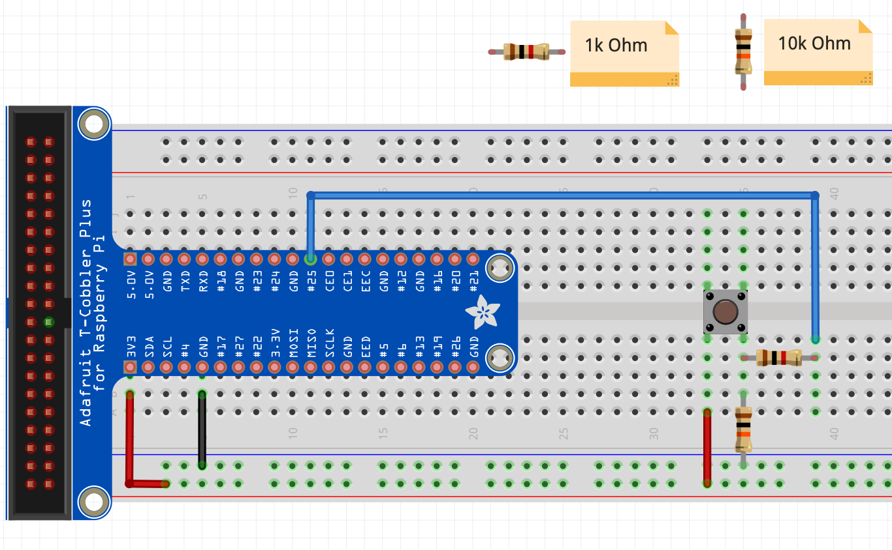

= Pi4J V2 :: Raspberry Pi OS for Java

image:https://img.shields.io/github/contributors/Pi4J/pi4j-os[Contributors,link=https://github.com/Pi4J/pi4j-os/graphs/contributors]
image:https://img.shields.io/github/license/Pi4J/pi4j-os[License,link=https://github.com/Pi4J/pi4j-os/i/blob/main/LICENSE]

This project provides pre-built versions of OS images with all you need to develop 100% pure Java applications for specific Raspberry Pi setups. They are based on the latest official https://www.raspberrypi.org/software/[Raspberry Pi OS] and are automatically built using Packer. By using these images, you will get:

* preconfigured locale (en_US), keyboard (US) and timezone (Europe/Zurich)
* preconfigured wireless country (Switzerland) by default
* remote management via `SSH` and `VNC` enabled by default
* preinstalled https://openjdk.java.net[OpenJDK 17] with latest https://gluonhq.com/products/javafx/[JavaFX 20]
* starter script to launch JavaFX-apps in DRM (aka kiosk-mode)
* preconfigured `/boot/config.txt` supporting all components out of the box
* dynamic wallpaper that shows Ethernet/WLAN address and hostname
* default WLAN connection
** setup a hotspot, for example on your smartphone, and you are ready to go.
*** ssid: `Pi4J-Spot`
*** password: `MayTheSourceBeWithYou!`
** your laptop has to be in the same WLAN as the RaspPi

The zip-compressed archives can be downloaded from https://pi4j-download.com[pi4j-download.com].

* Extract it and flash it with the imaging tool of your choice to get started.
** We recommend to use https://www.raspberrypi.org/blog/raspberry-pi-imager-imaging-utility/[Raspberry Pi Imager].

== Provided OS versions

=== Pi4J-Basis-OS
* support for building 100% pure Java applications using https://pi4j.com[Pi4J], https://openjfx.io[JavaFX]
* link:https://pi4j-download.com/latest.php?flavor=basic[download Latest Pi4J-Basic-OS Image]
* user account `pi`, password `pi4j`
* can be used for all kind of Pi4J- , JavaFX-, or FXGL-projects
* use https://github.com/Pi4J/pi4j-template-javafx[RaspiFX template project] to start your JavaFX/Pi4J or plain Pi4J project

=== Pi4J-CrowPi-OS

* all of Pi4J-Basic-OS
* support for https://www.elecrow.com/crowpi-compact-raspberry-pi-educational-kit.html[CrowPi]
* link:https://pi4j-download.com/latest.php?flavor=crowpi[download latest CrowPi Image]
* user account `pi`, password `crowpi`
* comes with `lirc` preinstalled to run the IR receiver component
* use https://github.com/Pi4J/pi4j-example-crowpi[CrowPi template project] to start your CrowPi experiments

=== Pi4J-Picade-OS

* all of Pi4J-Basic-OS
* support for https://shop.pimoroni.com/products/picade-console[Picade Console]
* link:https://pi4j-download.com/latest.php?flavor=picade[Download Picade Image]
* user account `pi`, password `picade`
* use link:[FXGL template project] to start your Picade project (available soon)

== Community

Our OS images are used here

* https://www.fhnw.ch/en/degree-programmes/engineering/computer-sciences[FHNW School of Engineering | Computer Science Bachelor]
* _drop us a note if you want to be listed here_

== Contact

* link:mailto:frank@webtechie.be[Frank Delporte]
* link:mailto:dieter.holz@fhnw.ch[Dieter Holz]
* link:https://join.slack.com/t/pi4j/shared_invite/zt-w1znjtnk-fYF58iO0oc4GH9LtQmvGTg[Pi4J Slack Channel]

== Sponsors

You can support the project or show interest by simply starring the repo or becoming a sponsor to let it live long and prosper.

=== Individual sponsors

* Pascal Mathis
* _your name can be listed here_

=== Companies, schools and universities

* https://karakun.com[Karakun]

* https://gluonhq.com[Gluon]

* _your company is missed here_

== Test the Pi4J OS-Images

The images contain two simple applications in directory `java-examples` and a sample file to test the audio channel. Start them via `ssh`.

=== Audio Test

[source, shell]
cd /home/pi
nvlc Music/StarTrekTheme.mp3

=== Pure JavaFX Application

Compile the JavaFX application

[source, shell]
cd /home/pi/java-examples/pure-javafx
javac --module-path /opt/javafx-sdk/lib --add-modules=javafx.controls,javafx.media hellofx/HelloFX.java

To start `HelloFX` in DRM
[source, shell]
sudo java-kiosk hellofx.HelloFX

`java-kiosk` is a command provided by our image. It assures to call `java` with the correct (and huge) set of parameters.

To start `HelloFX` in X11-Mode
[source, shell]
DISPLAY=:0 XAUTHORITY=/home/pi/.Xauthority sudo -E java --module-path /opt/javafx-sdk/lib --add-modules javafx.controls,javafx.media -Dglass.platform=gtk hellofx.HelloFX

=== Pure Pi4J Application

Attach a button to `pin 25`. 

- on CrowPi that's the `left`-button. 
- on Picade Console that's the `button-4`-button. 
- Otherwise:

Compile and start the Java application
[source, shell]
cd /home/pi/java-examples/pure-pi4j
javac -cp "/home/pi/deploy/*:." hellopi4j/MinimalPi4J.java
sudo java -cp "/home/pi/deploy/*:." hellopi4j.MinimalPi4J

== Additional Test for Pi4J-Picade-OS Image

The audio test should use the internal loudspeaker.

Check the mapping of the Picade buttons to JavaFX KeyCodes:

|===
|Picade |KeyCode

|Joystick up
|KeyCode.UP

|Joystick down
|KeyCode.DOWN

|Joystick left
|KeyCode.LEFT

|Joystick right
|KeyCode.RIGHT

|right side black button
|KeyCode.ENTER

|left side black button
|KeyCode.ESCAPE

|all other buttons
|no mapping
|===

Compile the JavaFX application

[source, shell]
cd /home/pi/java-examples/pure-picade
javac --module-path /opt/javafx-sdk/lib --add-modules=javafx.controls,javafx.media hellopicade/HelloPicade.java

To start `HelloPicade` in DRM

[source, shell]
sudo java-kiosk hellopicade.HelloPicade

To start `HelloPicade` in X11-Mode
[source, shell]
DISPLAY=:0 XAUTHORITY=/home/pi/.Xauthority sudo -E java --module-path /opt/javafx-sdk/lib --add-modules javafx.controls,javafx.media -Dglass.platform=gtk hellopicade.HelloPicade

== LICENSE

This repository is licensed under the Apache License, Version 2.0 (the "License"); you may not use this file except in compliance with the
License. You may obtain a copy of the License at: http://www.apache.org/licenses/LICENSE-2.0

Unless required by applicable law or agreed to in writing, software distributed under the License is distributed on an "AS IS" BASIS,
WITHOUT WARRANTIES OR CONDITIONS OF ANY KIND, either express or implied. See the License for the specific language governing permissions and
limitations under the License.
