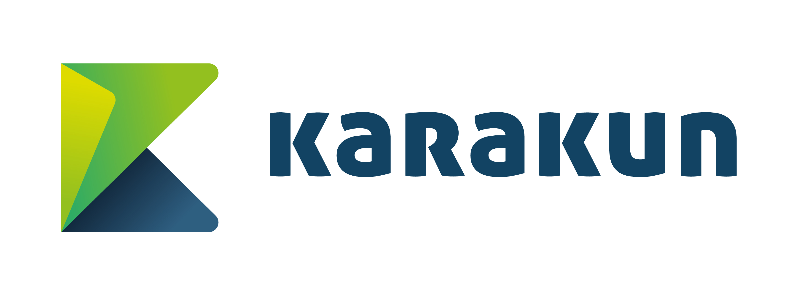

# Pi4J V2 :: Raspberry Pi OS for Java

This project provides pre-built versions of custom OS images with all you need to develop 100% pure Java applications for specific Raspberry Pi setups. It is based on the latest official [Raspberry Pi OS](https://www.raspberrypi.org/software/) and automatically built using Packer. By using these images, you will get:
- user account `pi`, password `crowpi`
- Preconfigured locale (en_US), keyboard (US) and timezone (Europe/Zurich)
- Preconfigured wireless country (Switzerland) by default
- Remote management via SSH and VNC enabled by default
- Preinstalled [OpenJDK 11](https://openjdk.java.net) with latest [JavaFX](https://openjfx.io) 
- Starter script to launch JavaFX-apps in DRM (aka kiosk-mode) 
- Preconfigured `/boot/config.txt` supporting all components out of the box
- Dynamic wallpaper that shows Ethernet/WLAN address and hostname
- Default WLAN connection
  - Setup a hotspot, for example on your smartphone, and you are ready to go.
      - ssid: `Pi4J-Spot`
      - password: `MayTheCodeBeWithYou!`
  - your laptop has to be in the same WLAN as the RaspPi

You may download the zip-compressed archives, extract it and flash it with the imaging tool of your choice to get started. We recommend to use [Raspberry Pi Imager](https://www.raspberrypi.org/blog/raspberry-pi-imager-imaging-utility/).

## Provided OS versions

- **CrowPi OS**
  - support for [CrowPi](https://www.elecrow.com/crowpi-compact-raspberry-pi-educational-kit.html)
  - can be used as a basis for all kind of Pi4J- , JavaFX-, or FXGL-projects  
  - comes with `lirc` preinstalled to run the IR receiver component
  - use [CrowPi template project](https://github.com/Pi4J/pi4j-example-crowpi) to start your CrowPi project
  - use [Java template project]() to start your plain JavaFX, FXGL, or Pi4J project 
    

- **Picade OS**
  - all of the CrowPi OS  
  - support for [Picade Console](https://shop.pimoroni.com/products/picade-console)
  - use [FXGL template project]() to start your Picade project
  

- **Game HAT OS**
  - all of the CrowPi OS
  - support for [Game HAT](https://www.waveshare.com/wiki/Game_HAT)
  - use [FXGL template project]() to start your Game HAT project

## Community
Our OS images for Java are used here
- [FHNW School of Engineering | Computer Science Bachelor](https://www.fhnw.ch/en/degree-programmes/engineering/computer-sciences) 
- _drop us a note if you want to be listed here_

## Contact
- [Frank Delporte](mailto:frank@webtechie.be)
- [Dieter Holz](mailto:dieter.holz@fhnw.ch)
- [Pi4J Slack Channel](pi4j.slack.com)

## Sponsors
You can support the project or show interest by simply starring the repo or becoming a sponsor to let it live long and prosper.

### Individual sponsors
- Pascal Mathis
- _your name can be listed here_

### Companies, schools and universities
- [Karakun](https://karakun.com)
  
- [Gluon](https://gluonhq.com)  
- _your company is missed here_ 

## LICENSE

This repository is licensed under the Apache License, Version 2.0 (the "License"); you may not use this file except in compliance with the
License. You may obtain a copy of the License at: http://www.apache.org/licenses/LICENSE-2.0

Unless required by applicable law or agreed to in writing, software distributed under the License is distributed on an "AS IS" BASIS,
WITHOUT WARRANTIES OR CONDITIONS OF ANY KIND, either express or implied. See the License for the specific language governing permissions and
limitations under the License.
