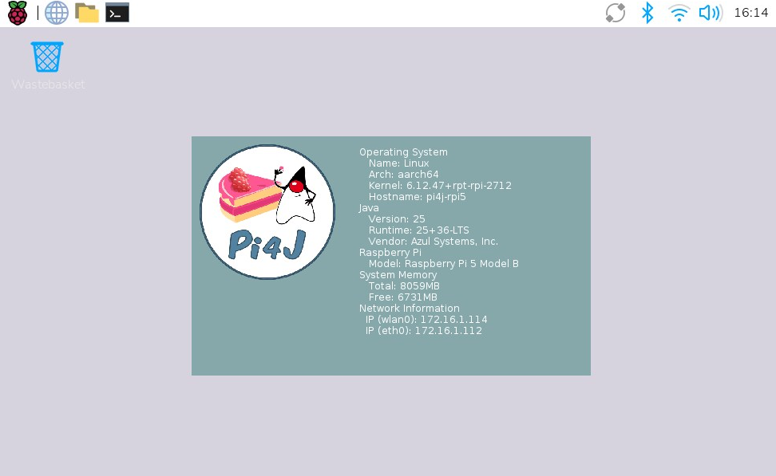

# Pi4J V2 :: Tools to prepare Raspberry Pi OS for Java

[](https://github.com/Pi4J/pi4j-os/graphs/contributors)
[](https://github.com/Pi4J/pi4j-os/blob/main/LICENSE)

This project provides some scripts to extend the official Raspberry Pi Operating System with additional tools to make it the perfect match for Java projects with Pi4J as described on [the Pi4J website > Prepare a Raspberry Pi](https://www.pi4j.com/prepare/).

## How To Use

### Script to Setup for Java

1. Prepare an SD Card with the 64-bit version of the Raspberry Pi Operating System, see [the Pi4J website > Prepare a Raspberry Pi > Write OS to SD card](https://www.pi4j.com/prepare/sd-card/).
2. Put the SD Card in your Raspberry Pi and start it.
3. The board will probably reboot to do some basic settings.
4. Make sure the board is connected to WiFi or cabled internet.
5. Open the terminal and run this command:
    ```shell
    curl -sL https://raw.githubusercontent.com/Pi4J/pi4j-os/main/script/prepare-for-java.sh | bash
    ```
6. Make sure you see `All done! Have fun...` if the script finished. If not, you may need to run it again as one of the intermediate steps has stopped it.
7. You're done! Check [the Pi4J website > Getting Started With Pi4J](https://www.pi4j.com/getting-started/) for the next steps. Have fun with #JavaOnRaspberryPi.

### Wallpaper

An additional Java (JBang) script is available to turn the desktop wallpaper into an information screen. This script will take an image as input, overlay some useful info as text (IP, Java version, etc.), and save this as a new image. This generated image is then pushed as the new wallpaper to the desktop.

1. To install the script, open the terminal and run this command:
2. Open the script:
   ```shell
   sudo nano /etc/NetworkManager/dispatcher.d/99-ip-change-notify
   ````
3. Adjust the `pi4j` username in the script (3 times) to match the one you use for your Raspberry Pi. E.g. on this line: `IP_FILE="/home/pi4j/wallpaper/current_ip_$interface.txt`.
4. Save the file with `CTRL+X` + `y` + `ENTER`.

This will generate a result like this:



If you want to run this script automatically, you can use a watch in the terminal. The following example will refresh the background every 10 seconds:

```shell
watch -n 10 jbang GenerateWallpaperInfoImage.java wallpaper-1-1920x1080.png wallpaper-out.png 1280 800
```

## History Of This Repository

The original goal of this repository was to provide a build of the official Raspberry Pi OS with additional tools to prepare it for Java(FX) and Pi4J projects. Because it became difficult to support because of changes in the OS for the Raspberry Pi 5, we decided to stop this goal, and provide some scripts here that can help you to achieve the same result. You can still find the latest sources of the Pi4J OS here with the tag [end-of-os](https://github.com/Pi4J/pi4j-os/releases/tag/end-of-os).

## License

This repository is licensed under the Apache License, Version 2.0 (the "License"); you may not use this file except in compliance with the
License. You may obtain a copy of the License at: http://www.apache.org/licenses/LICENSE-2.0

Unless required by applicable law or agreed to in writing, software distributed under the License is distributed on an "AS IS" BASIS,
WITHOUT WARRANTIES OR CONDITIONS OF ANY KIND, either express or implied. See the License for the specific language governing permissions and
limitations under the License.
